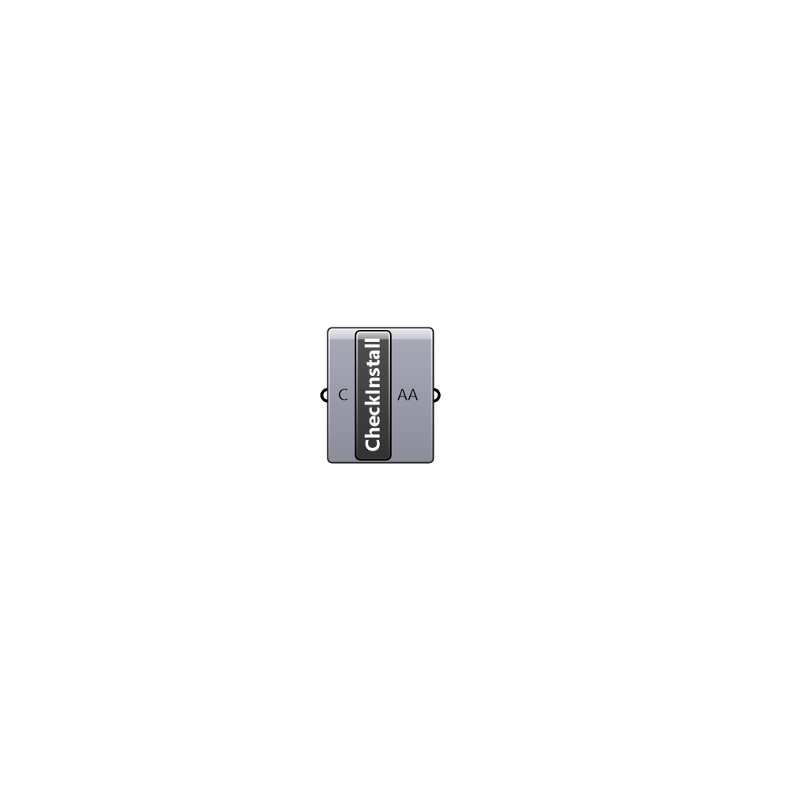

##  Check Installation - [[source code]](https://github.com/Eddy3D-Dev/Eddy3D/tree/dev/Check%20Installation.cs)

Checks installation

#### Inputs
* ##### C []
Set to true to check if dependendies were installed correctly

#### Outputs
* ##### AA
Attributes of this plugin assembly