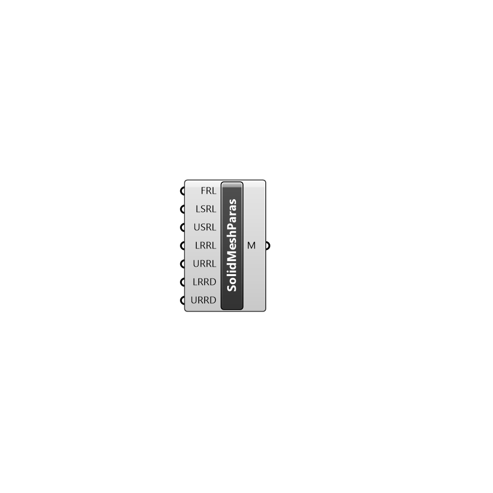

##  Solid Mesh Parameters - [[source code]](https://github.com/Eddy3D-Dev/Eddy3D/tree/dev/Solid%20Mesh%20Parameters.cs)

Meshing parameters for solid for Solid Type component.

#### Inputs
* ##### FRL []
Feature refinement level
* ##### LSRL []
Lower value of surface refinement level
* ##### USRL []
Upper value of surface refinement level
* ##### LRRL []
Lower value of region refinement level
* ##### URRL []
Upper value of region refinement level
* ##### LRRD []
Lower distance to which apply region refinement level
* ##### URRD []
Upper distance to which apply region refinement level

#### Outputs
* ##### M
Solid mesh paremeters for Solid Type component.