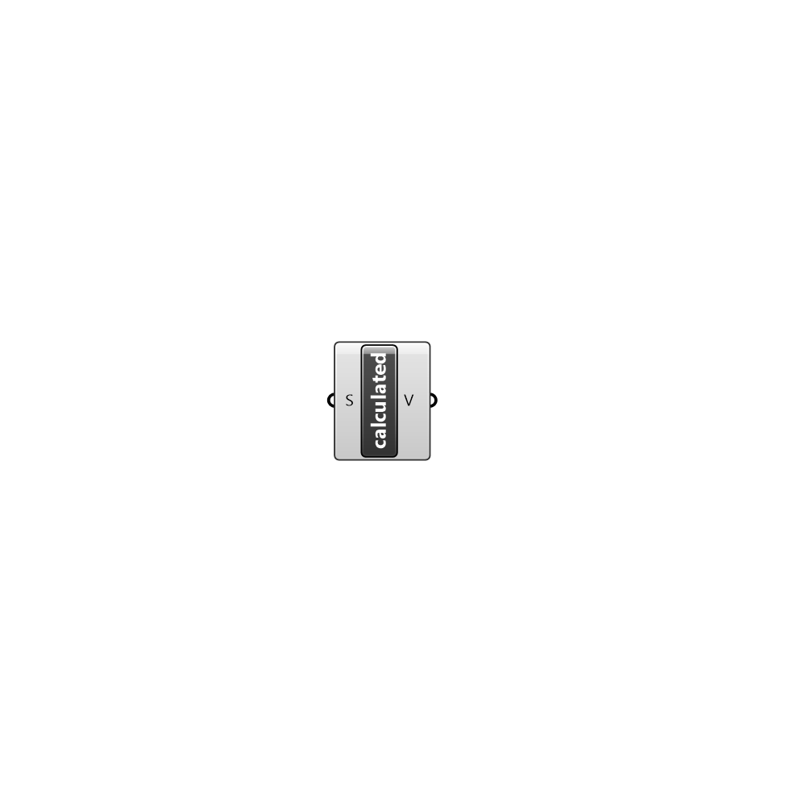

##  calculated - [[source code]](https://github.com/Eddy3D-Dev/Eddy3D/tree/dev/calculated.cs)

calculated value

#### Inputs
* ##### S []
Scalar component of uniform value.

#### Outputs
* ##### V
The created calculated value instance.